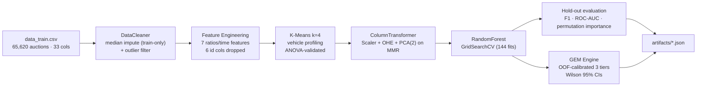

# Automotive Auction Risk & Opportunity Engine — Used-Car Lemon Detection + Opportunity Mining

[](../../actions/workflows/ci.yml)
[](LICENSE)
[](https://www.python.org/)
[](https://scikit-learn.org/)

A leakage-safe machine-learning pipeline for a US used-car auction buyer:
raw auction records → cleaning → domain feature engineering → K-Means vehicle
profiling → RandomForest classifier → **GEM opportunity engine**. It flags
high-risk "lemon" purchases *and* mines low-risk undervalued opportunities, then
exports the compact JSON the portfolio site renders. One command runs the whole
thing: `python scripts/run_pipeline.py`.

<!-- SCREENSHOT: ROC curve + confusion matrix -->
<!-- SCREENSHOT: GEM tier success-rate table with Wilson CIs -->

## What makes this different

Most lemon classifiers stop at a single F1 number. This project does not:

- **A self-initiated opportunity layer.** The brief asked only for binary lemon
  classification. On top of that I built the **GEM engine** (Good buy /
  undervalued opportunity Mining) — a three-tier system that turns the model's
  probabilities into actionable buying signals (Bargain / Undervalued / Market
  Quality), each excluding the statistically riskiest vehicle cluster.
- **Honest ML discipline.** A leakage audit runs through every stage: imputation
  medians and the warranty ratio are fit on the training split only, K-Means is
  fit on train and merely predicts on test, and the GEM threshold is calibrated
  **out-of-fold** (5-fold `cross_val_predict`) so the hold-out is never seen
  during calibration. Class imbalance (~12 % lemons) is handled with
  `class_weight="balanced"` and an F1-of-the-minority-class objective.
- **It beats the standard baseline — and proves it.** Against a standard
  balanced RandomForest baseline (F1 0.34, with precision inflated by near-zero
  recall), this model reaches **test F1 0.42** by deliberately trading precision
  for recall, because a missed lemon costs real money while a missed bargain
  only costs an opportunity.
- **Statistically grounded claims.** Every GEM tier's success rate is reported
  with a **Wilson 95 % confidence interval** on the hold-out set — not a point
  estimate dressed up as certainty.

## Architecture



The classifier picks the model; the GEM engine sits on its `predict_proba` and
mines opportunities the brief never asked for.

## Quick start

```bash
git clone https://github.com/murat-suer/automotive-auction-risk-engine
cd automotive-auction-risk-engine
git lfs pull                                   # fetch the 12 MB dataset

uv venv && uv pip install -e ".[test]"         # or: pip install -e ".[test]"
python scripts/run_pipeline.py                 # full pipeline → artifacts/
```

The run is fully seeded (`random_state=42`), so it reproduces the committed
`artifacts/*.json`.

## The opportunity loop

1. The RandomForest scores every vehicle's lemon probability; `prob_good = 1 - p`.
2. The tier-1 (**Bargain**) threshold is calibrated out-of-fold to ~95 %
   precision on the good-buy class, so high-confidence picks are genuinely safe.
3. Three tiers are formed, each excluding the riskiest K-Means cluster:
   **Bargain** (cheap + high-confidence), **Undervalued** (priced below current
   auction average), **Market Quality** (market-priced + very high confidence).
4. Each tier is backtested on the untouched hold-out and reported with a Wilson
   95 % CI — so a buyer knows not just the hit rate but its uncertainty.

## Results

Hold-out test set (6,562 vehicles, 12.2 % lemons):

| Metric | Standard RF baseline | This model | Note |
|---|---|---|---|
| F1 (lemon class) | 0.34 | **0.42** | +24.8 % over baseline |
| Recall (lemon) | 0.22 | **0.39** | +17 pp — fewer missed lemons |
| Precision (lemon) | 0.89* | 0.47 | *baseline precision inflated by near-zero recall |
| ROC-AUC | — | **0.77** | threshold-independent separability |

The baseline's 0.89 precision is not quality — it almost never predicts
"lemon," so it is rarely wrong but catches almost nothing (recall 0.22). Raising
recall to 0.39 necessarily lowers precision; that is the deliberate, cost-aware
trade-off, not a regression.

**GEM opportunity engine** — good-buy hit rate vs. the ~88 % no-filter base rate:

| Tier | Strategy | Success rate (Wilson 95 % CI) | n |
|---|---|---|---|
| GEM1 | Bargain Buy | **91.9 %** (88.1–94.5) | 283 |
| GEM2 | Undervalued Find | **94.9 %** (93.0–96.3) | 723 |
| GEM3 | Market Quality | **97.2 %** (95.8–98.1) | 812 |

GEM3 cuts the effective lemon rate from ~12 % to under 3 % on its picks.

## Development

```bash
uv pip install -e ".[test]"      # or pip
pytest -q                        # 10 unit tests (leakage, features, Wilson CI)
ruff check src scripts tests
```

## Project structure

```
src/auto_risk/
├── config.py          # paths, seed, hyperparameters, GEM thresholds
├── data.py            # loading + stratified 90/10 split
├── cleaning.py        # leakage-safe DataCleaner + outlier filter
├── features.py        # 7 engineered features, K-Means profiling, ANOVA
├── preprocessing.py   # ColumnTransformer (Scaler + OHE + MMR PCA)
├── modeling.py        # 6-model CV benchmark + RF GridSearch
├── evaluation.py      # metrics, ROC, permutation importance
├── gem.py             # OOF-calibrated 3-tier opportunity engine + Wilson CI
└── artifacts.py       # 7 JSON artifact builders
scripts/run_pipeline.py   # end-to-end orchestrator
artifacts/                # committed, validated JSON outputs
data/                     # data_train.csv (Git LFS) + data dictionary
tests/                    # leakage / feature / GEM unit tests
```

## Methodology & anti-leakage

The full methodology walkthrough and the explicit anti-leakage guarantees are
in [docs/METHODOLOGY.md](docs/METHODOLOGY.md). In short: every fitted statistic
(medians, warranty ratio, scaler, K-Means, GEM threshold) is learned on training
data only; the test split is touched exactly once, at final evaluation.

## Honest limitations

This is a portfolio project trained on a single public dataset — and it says so:

- The data is a public Carvana-derived used-car auction set; results are specific
  to its distribution and would need re-fitting on a buyer's own history.
- F1 ≈ 0.42 reflects a genuine ceiling on this dataset — hidden mechanical
  defects are only partially observable from the recorded auction fields.
- GEM thresholds and the "risky cluster" are calibrated to this distribution; a
  different fleet would re-calibrate them.
- There is no live inference service here — the pipeline produces static JSON
  artifacts that the portfolio site renders.

## Author

**Murat SÜER** — environmental engineer (15 years in engineering & occupational
safety) turned data scientist. This project sits where those two careers meet:
the cost-asymmetry reasoning and risk framing come from industrial practice; the
leakage-safe ML pipeline comes from the new one.

[muratsuer.eu](https://muratsuer.eu) · murat@muratsuer.eu

Licensed under [AGPL-3.0](LICENSE).
